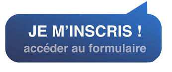
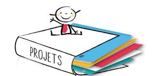
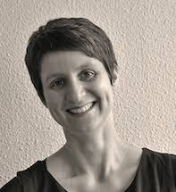
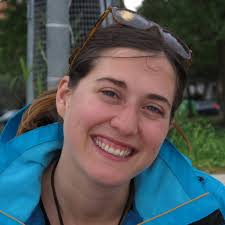
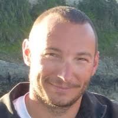
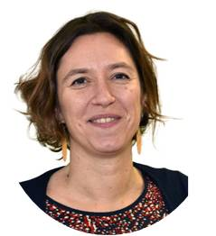
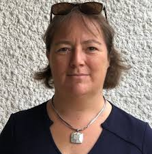

# [Hackathon MoDaL Biogenouest 2021](https://biogenouest.github.io/biogen-hack-2020/)

Nous sommes ravis de vous annoncer que le hackathon MoDaL aura lieu les 25 janvier et le 1er février 2021 !

Après vous avoir questionné autour de vos expériences et attentes en intégration de données, nous avons perçu un vrai intérêt sur cet aspect de l’analyse des données et un intérêt croissant pour les principes FAIR. 

Le Hackathon aura pour but le travail collaboratif, le partage d'expériences et de  connaissances et la co-conception de solutions informatiques innovantes autour de l’intégration de données hétérogènes. 

Lors de cet événement, nous travaillerons ensemble sur des mini-projets de votre choix. Pendant ce temps chaque compétence est la bienvenue, en bio-informatique et dans le domaine de la science de la vie. 

Tous les projets seront présentés lors du premier jour du Hackathon et chaque participant pourra décider auquel collaborer !

D'autres espaces seront également à votre disposition : 
- **Exposés flash**, où chacun d’entre vous pourra exposer brièvement (environ 5 min) un retour d’expérience en intégration de données, un outil ou un sujet qui vous tient à cœur !
- **Tutoriels**, facultatif, sera prévu en parallèle au travail sur les mini-projets. Ces tutoriels dureront environ 30 min et cibleront un outil et/ou une méthode autour de l’intégration de données et des principes FAIR.   

**N'hesitez pas, au cours du hackathon, à vous manifester pour proposer un sujet et l'exposer !!**

[SOUMETTRE UN MINI-PROJET](soumettre_projet.html)

# Mini-projets 

## [GenFlow](GenFlow.html)

### Personne contact : 
Thomas Darde - BioMas

### Participants :
Paul Rivaut, François Moreews et …

### Description du projet et des données utilisées :
Développement d’un espace de dépôt pour les workflows utilisés lors de l’analyse de données génomique issus de publications scientifique. Chaque workflow est extrait automatiquement de la publication quand c’est possible (text minning) ou les utilisateurs peuvent déployer leurs propres workflows via une interface dédiée. Toute information déposée sur cet espace doit être caractérisée par l’utilisation de vocabulaire contrôlé.

### Résultats attendus :
- Indexation outils bio-info (connaissances bio-info générales)
- Indexation ontologies pertinente (connaissances bio-info générales)
- Interface web de soumission de workflow avec utilisation des ontologies (dev web)
- Script d’extraction de workflow depuis une publication scientifique (text minning)
- Script de suggestion de stratégie d’analyse de donnée en fonction d’un outil données (marchin learning)

## [Humess](Humess.html)

### Personne contact : 
Philippe Bordron

### Participants :
Chaque collaboration est la bienvenue !

### Description du projet et des données utilisées :
Humess est un projet de reconstruction à façon de réseaux métaboliques humains fontionnels à partir de données d’expression de 3’SRP ainsi que de leur analyse à l’aide d’une approche de corrélation de flux métabolique.

À partir de réseaux métaboliques fonctionnels, les analyses en corrélation de flux métabolique produises de grandes matrice de corrélation entre réactions (environ 5000x5000 en moyenne sur un réseau humain). Ces matrices donne une sur-approximation de la dynamique métabolique existant dans les réseaux étudiés. Dans le cadre de ce hackathon, je souhaite travailler sur les représentations et l’accessibilité des obtenus.

### Résultats attendus :
Je souhaite tout d’abord comparer des matrices de corrélation obtenues sur plusieurs organes ou conditions: 
- **1.a** d’un point de vue global, comparer les organes. C’est à dire calculer une dissimilarité (distance) ou une similarité entre chaque organe. De approches de comparaison de matrices de covariance ont déjà été tentées (procrustes, test de mantel) , mais les résultats sont mitigés. 
- **1.b** d’un point de vue plus spécifique; déterminer ce qui change et ne change pas entre les organes, au delà des réactions et des métabolites spécifiques à chaque réseau.

La difficulté de ce point n’est pas vraiment technique, mais méthodologique. Nous manipulons des millions de corrélations entre réactions et les approches statistiques utilisant des matrices ‘feature x échantillon’ (e.g. RNASeq, …) sont difficilement applicable.

Je souhaite également travailler sur les aspects visualisation et enrichissement des résultats: 
- **2.a** Projeter les résultats obtenus sur des réseau métaboliques existants. Tout d’abord les réseaux métaboliques reconstruits, mais également une manière re représenter les matrice de corrélation de façon intelligible malgré leur grande dimension. 
- **2.b** Projeter/intégrer/enrichir ces résultats avec les analyses transcriptomiques effectuées en parallèle. 
- **2.c** envisager d’autres sources omique à intégrer (proteomique, metabolomique, …)

Seule une phase de recherche sur quelques outils possibles a été effectuée pour cette partie.
Toute proposition est la bienvenue !

## [Adipodata, an integrative view ?](Adipodata.html) 

### Personne contact :
Isabelle Hue

### Participants :
Chaque collaboration est la bienvenue !

### Description du projet et des données utilisées :
Analyse in silico de données publiées sur les adipocytes de diverses espèces:

- **(i)** sgle-cell RNAseq chicken breast muscle => sous populations cellulaires https://bigd.big.ac.cn/search/?dbId=gsa&q=CRA002353

- **(ii)** LncRNAs fatty/lean pig meat: pas de dépot de données identifié, cf publi https://doi.org/10.1021/acs.jafc.8b04243

- **(iii)** adipocyte secretome: autocrine/paracrine/endocrine signaling: https://doi.org/10.1007/s00018-019-03256-5 (human data) Human Adipokine ELISA kit: epitopes? primary/tertiary structure?

- **(iv)** Oncorhynchus mykiss (rainbow trout) genome => orthologous gene mapping

### Résultats attendus :
- **(i)** interpoler les données RNAseq porc/poulet sur les adipocytes intra-musculaires; en déduire des jeux de gènes/marqueurs pour ces cellules; combien seraient utilisables chez la truite? en dériver des jeux de primers

- **(ii)** y retrouve-t-on tout ou partie du secrétome décrit chez l’homme: facteurs de croissance, adipokines? pourrait-on utiliser les outils humains (anticorps, kit Elisa ici) pour détecter ces facteurs chez le poisson dans du milieu de culture adipocytaire par exemple? conservation des séquences et structures protéiques?

- **(iii)** pourrait-on étendre cette approche à d’autres espèces pour explorer secrétomes (10.3390/ijms21124375.; 10.1039/c6mb00224b.) et sous-populations cellulaires d’autres dépôts adipeux (https://doi.org/10.1016/j.tcb.2020.09.007) pour aller vers une vision intégrative des données publiées, source d’ hypothèses à évaluer sur la truite et/ou le poisson-zèbre? => mise en place de manips
     
     
# Pré-programme 

**Lundi 25 (9h30 - 16h30)** 

9h30-10h :  Introduction
  10h-12h :   Présentation de mini projets (2-3 diapos par projet / environ 5 min) et travail en groupe sur les mini-projets 

  14h - 14h30 : Exposés flash flash
  14h30 - 15h : Travail en groupe sur les mini-projets
  15h - 15h30 : (facultatif) tutoriel 
  16h - 16h30 : Checkpoint avancement des projets 

**Lundi 1 (10h - 16h30)**

10h - 10h15 : Bonjour - questions ? 
  10h15 - 12h : Travail en groupe sur les mini-projets 
  11h - 11h30 : (facultatif) tutoriel  

  14h - 14h30 : Exposés flash flash 
  14h30 - 15h : Travail en groupe sur les mini-projets
  15h - 16h   : Expo résultats obtenus par groupe 
  16h - 17h : Conclusions

# Organisateurs

[Projet fédérateur MoDaL](Projet_modal.html)

## L'équipe MoDaL se présente : 

| | |
|-----------|-----|
|**Alban Gaignard**   |Alban est ingénieur de recherche CNRS à l'Institut du Thorax à Nantes. Ses recherches portent sur la représentations des connaissance (web sémantique, données liées) et les systèmes distribués (workflows, provenance) pour mieux intégrer et réutiliser les données des sciences de la vie. Depuis 2019, pour l’institut francais de bioinformatique (IFB), il co-anime l’action nationale “interopérabilité” et contribue à l'infrastructure européenne de bioinformatique Elixir.|
|**Camille Maumet**   |Camille est chargée de recherche en neuroinformatique à Inria, Univ Rennes, CNRS, Inserm dans l'équipe Empenn. Camille développe des méthodes statistiques et informatiques pour permettre le partage et la réutilisation de données en imagerie cérébrale. Elle soutient aussi activement la science ouverte. Elle a été précédemment post-doc à l'université de Warwick et à l'université d'Oxford où elle s'est intéressée aux méta-analyses d'images de résonance magnétique fonctionnelle.|
|**Sofia Strubbia**     |Sofia est ingénieure de recherche INSERM au sein de l'Institut du Thorax, à Nantes. De formation vétérinaire, elle s’est spécialisée en sécurité alimentaire avant de se former aux problématiques de Santé Unique. Elle est titulaire d’un doctorat en microbiologie, spécialité virologie. Sofia c’est formée à la métagénomique virale sur des échantillons environnementales au sein du laboratoire “Virus Discovery” de l’Erasmus Medical Center, Rotterdam. Depuis 2020 elle est animatrice du projet fédérateur MoDaL au sein de Biogenouest.|
**Olivier Dameron**    |Olivier est professeur d’informatique à l’université de Rennes 1 et responsable de l’équipe Dyliss au laboratoire IRISA à Rennes. Il développe des méthodes basées sur les ontologies pour intégrer, interroger et analyser des données biomédicales. Cela fait intervenir des compétences en représentation des connaissances et en bioinformatique et repose sur le Web Sémantique et les données liées.|
|**Audrey Bihouée**         |Audrey est ingénieur d’études à l’Université de Nantes, et responsable technique de la plateforme de Bioinformatique BiRD. Après un master en neurosciences, elle a obtenu une double-compétence en informatique grâce à un master complémentaire. Elle a intégré la plateforme d’abord sur le volet bio-analyse de projets transcriptomiques et occupe aujourd’hui des missions de coordination dans les réseaux des plateformes de Biogenouest et de l’IFB.|
|**Anne Siegel**      |Anne est directrice de recherche au CNRS, et exerce ses recherches dans l’équipe Dyliss au laboratoire IRISA à Rennes. Elle est responsable du département « Gestion des données et connaissances » à l’IRISA et chargée de mission “bioinformatique” au CNRS (INS2I). Elle a obtenu un doctorat en mathématiques avant de s’intéresser aux interfaces entre la biologie et l’informatique en développant des approches symboliques de représentation et d’intégration de connaissances pour analyser des réseaux biologiques à grande-échelle.|

Pour toutes informations complémentaires : [sofia.strubbia@univ-nantes.fr](sofia.strubbia@univ-nantes.fr)
